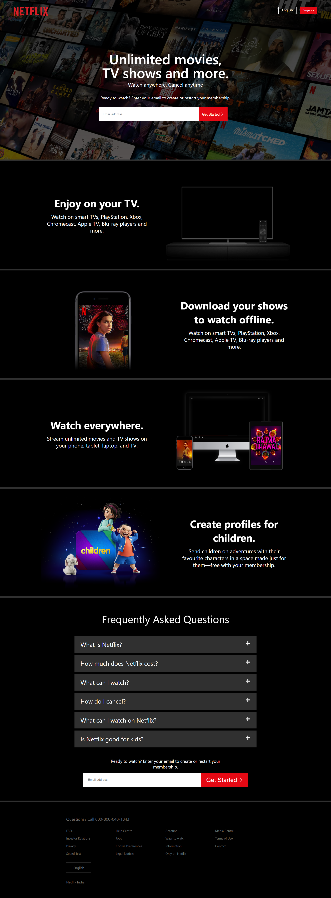

# Netflix Clone
> A fully responsive Netflix clone, created using ReactJs. For navigation inside the website I have used React router. The entire website is styled using CSS and Material UI. The project is hosted on netlify and developed using create react app.  

## Screenshot  

    

  

## Built With  
- ReactJs
- CSS
- Material UI
- React Router
- Create-react-App
## Links  
Live Site - [demo](https://animated-gaufre-45ae75.netlify.app/)
### Author
Made with ❤ by **Sourabh Yadav**

